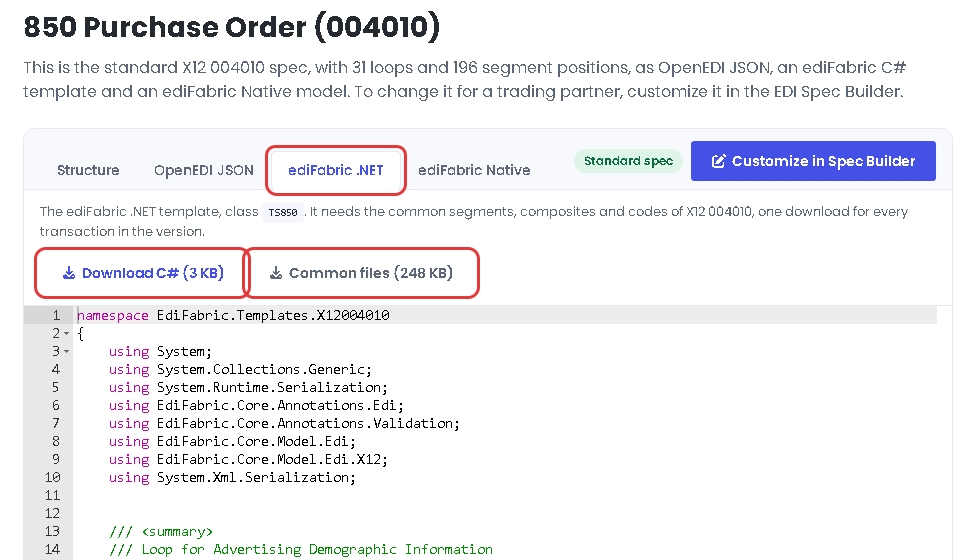
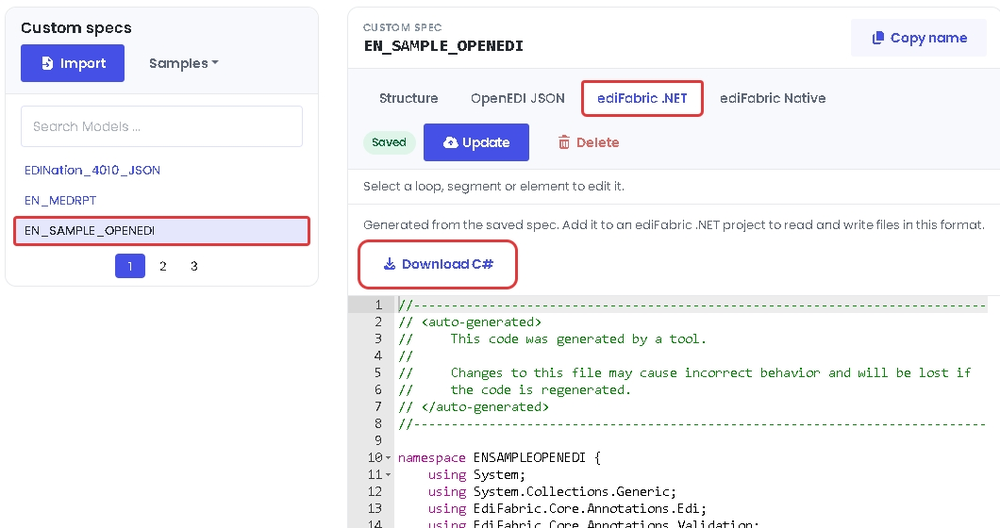

# EdiFabric C# .NET Examples for NCPDP Telecommunications

**EdiFabric 11.0.0** is a .NET SDK that parses, generates, validates, and splits EDI files. These examples cover **NCPDP Telecommunications D.0**.

EdiFabric does not include communication components (AS2 or SFTP), a dashboard, or a UI. It is a library you call from your own application.

The .NET 6 projects compile the same sources as the .NET Framework 4.8 projects. Both solutions reference [EdiFabric 11.0.0](https://www.nuget.org/packages/EdiFabric) and the template packages from NuGet. The examples target .NET 6 for backward compatibility. EdiFabric 11.0.0 also ships targets for .NET 8, .NET 9, and .NET 10. To evaluate one of those, change `TargetFramework` in the project file and rebuild.

| Path | Purpose |
| --- | --- |
| `NET 6/EdiFabric.Examples.NCPDP.Telco.sln` | .NET 6 solution |
| `NET Framework 4.8/EdiFabric.Examples.NCPDP.Telco.sln` | .NET Framework 4.8 solution |
| `NET Framework 4.8/EdiFabric.Examples.NCPDP.Telco.Common/Config.cs` | Serial key shared by every example |
| `NET Framework 4.8/EdiFabric.Examples.NCPDP.Telco.Demo/Program.cs` | Runnable walkthrough: read, then validate |
| `Files/` | Sample NCPDP Telecommunications messages |

## Requirements

- Visual Studio 2022, or the .NET SDK. [Download Visual Studio](https://visualstudio.microsoft.com/downloads/).
- .NET 6 for `NET 6/EdiFabric.Examples.NCPDP.Telco.sln`. The projects set `<TargetFramework>net6.0</TargetFramework>` so they stay compatible with existing .NET 6 apps. EdiFabric 11.0.0 also provides `net8.0`, `net9.0`, and `net10.0`. To evaluate a later version, change that property (for example to `net8.0`) and rebuild.
- .NET Framework 4.8 for `NET Framework 4.8/EdiFabric.Examples.NCPDP.Telco.sln`.

1. [Sign up free for **Community**](https://www.edifabric.com/pricing.html) to get an evaluation serial key. Community never expires, requires no credit card, and is limited to 250 operations per day for non-production use. After signup, retrieve your serial from [Your Account](https://www.edifabric.com/docs/getting-started/your-account.html).
2. Paste that serial into `TrialSerialKey` in `NET Framework 4.8/EdiFabric.Examples.NCPDP.Telco.Common/Config.cs`. The .NET 6 projects link this file, so one edit covers both solutions.

NuGet restore pulls **EdiFabric 11.0.0** and **EdiFabric.Templates.Ncpdp 3.0.0**.

## Getting started

**Sign up free for Community** at [edifabric.com/pricing](https://www.edifabric.com/pricing.html) and put your serial in `Config.TrialSerialKey`. Then open a solution, set **EdiFabric.Examples.NCPDP.Telco.Demo** as the startup project, and run it.

From the command line:

```bash
cd "NET 6/EdiFabric.Examples.NCPDP.Telco.Demo"
dotnet run
```

The demo reads `Files/ClaimBilling`, parses every transaction with `NcpdpTelcoReader`, and validates each one with `IsValid`. Set a breakpoint at the end of `Translate_NCPDP_D0` and inspect `ediItems`.

To translate your own file, change the path in `EdiFabric.Examples.NCPDP.Telco.Demo/Program.cs`.

## Usage

Every example calls `License.SetSerial` before it reads or writes. On Community that is the call to use. See [Licensing](#licensing) for Developer and Enterprise.

```csharp
using EdiFabric.Core.Model.Edi;
using EdiFabric.Framework.Readers;
using EdiFabric.Templates.TelcoD0;

License.SetSerial(serial);   // from your Community or paid plan

var ncpdpStream = File.OpenRead(@"Files\ClaimBillings");

List<IEdiItem> ncpdpItems;
using (var ncpdpReader = new NcpdpTelcoReader(ncpdpStream, "EdiFabric.Templates.Ncpdp"))
    ncpdpItems = ncpdpReader.ReadToEnd().ToList();

var claims = ncpdpItems.OfType<TSB1>();
```

`NcpdpTelcoReader` takes the stream and the template assembly name. `ReadToEnd` loads the file into memory. For large files, use the streaming samples in **ReadNCPDP**.

### Validation

After a transaction parses, `IsValid` checks it against the template. **ValidateNCPDP** shows custom codes, data types, and the transmission header.

```csharp
foreach (var message in ncpdpItems.OfType<EdiMessage>())
{
    if (message.HasErrors)
        continue;

    MessageErrorContext mec;
    if (!message.IsValid(out mec))
    {
        var validationIssues = mec.Flatten();
    }
}
```

### Writing NCPDP Telecommunications

**WriteNCPDP** builds a transmission with `NcpdpTelcoWriter`: the transmission header, then the claim. The same project covers writing to a file and batches.

```csharp
using (var stream = new MemoryStream())
{
    using (var writer = new NcpdpTelcoWriter(stream))
    {
        writer.Write(SegmentBuilders.BuildTransmissionHeader());
        writer.Write(SegmentBuilders.BuildClaim());
    }
}
```

## Examples by feature

| Project | What it shows |
| --- | --- |
| `EdiFabric.Examples.NCPDP.Telco.Demo` | Read a B1 billing claim and validate it |
| `EdiFabric.Examples.NCPDP.Telco.ReadNCPDP` | Read to end, stream, partner templates, corrupt transmission header, corrupt G1, split on a repeating loop, batches of B1 and RESPONSE |
| `EdiFabric.Examples.NCPDP.Telco.WriteNCPDP` | Write to a stream or file, and write batches |
| `EdiFabric.Examples.NCPDP.Telco.ValidateNCPDP` | Validate transactions, custom codes, data types, and the transmission header |
| `EdiFabric.Examples.NCPDP.Telco.JSON` | Serialize and deserialize JSON |
| `EdiFabric.Examples.NCPDP.Telco.XML` | `XmlSerializer` and `DataContractSerializer` |

For another transaction, download its C# template from the EDI spec library. See [EDI templates](#edi-templates).

## Licensing

> [!NOTE]
> Sign up free for the [Community plan](https://www.edifabric.com/pricing.html)
> to get an evaluation serial key. Community never expires, requires no credit
> card, and is for non-production evaluation, learning, and prototyping
> (250 operations per day). After signup, copy your serial from
> [Your Account](https://www.edifabric.com/docs/getting-started/your-account.html)
> into `Config.TrialSerialKey`.
>
> One operation is one parse, generate, validate, or acknowledge call. The 250-a-day
> quota is shared across ediFabric .NET, Native, and Cloud. If you hit it, calls
> throw `LicenseException` with [error 639](#error-codes). Upgrade at
> [edifabric.com/pricing](https://www.edifabric.com/pricing.html) to continue.
>
> Use of the product is subject to the [EULA](https://www.edifabric.com/files/eula.pdf).

| Plan | What works | Recommended |
| --- | --- | --- |
| Community | `License.SetSerial` only. Online check. 250 operations per day. Non-production. | `License.SetSerial` |
| Developer | `License.SetSerial` and `License.EnsureToken` (`EnsureToken` caches the result for 1 day) | `License.EnsureToken` |
| Enterprise | `License.SetSerial`, `License.GetToken` / `License.SetToken` | `License.SetToken` (offline tokens) |

```csharp
// Community: authorize against the license server
License.SetSerial(serial);

// Developer (recommended): 1-day built-in cache; refreshes if the token expires within N seconds
License.EnsureToken(serial, seconds: 3600);

// Enterprise: set an offline token
License.SetToken(token);
```

The examples call `License.SetSerial(Config.TrialSerialKey)`. On Developer, call `License.EnsureToken` instead. `TokenFileCache.Set()` in `EdiFabric.Examples.NCPDP.Telco.Common` is the manual `GetToken` / `SetToken` cache, for when you want to store the token yourself.

## Error codes

License failures throw `LicenseException`. `ErrorCode` is the number below, and `Message` is the text.

**Error 639** means the Community daily quota was exceeded. Upgrade your plan at [edifabric.com/pricing](https://www.edifabric.com/pricing.html) if you wish to continue.

| Code | Message |
| --- | --- |
| 1 | The suggested output buffer size is too small |
| 501 | Unexpected error occured. Contact support@edifabric.com for assistance |
| 611 | The input buffer is either null or its size is nill |
| 612 | The logger failed to log |
| 613 | The map configuration file is invalid |
| 614 | The output capacity must be positive |
| 615 | Models map must be set before parsing or splitting |
| 616 | Mode must be any of: 1 - Parse, 2 - Parse and Validate, 3 - Parse and Validate and Acknowledge |
| 617 | Parser failed. Contact support@edifabric.com and include a sample project/file to reproduce the issue |
| 618 | Validation failed. Contact support@edifabric.com and include a sample project/file to reproduce the issue |
| 619 | Validation serializer failed. Contact support@edifabric.com and include a sample project/file to reproduce the issue |
| 620 | The token is invalid. Contact support@edifabric.com for assistance |
| 621 | The configuration file is invalid |
| 622 | The split segment ID must not be blank |
| 623 | Call start_split before splitting |
| 624 | The result can't be retrieved. Contact support@edifabric.com and include a sample project/file to reproduce the issue |
| 625 | Result buffer size mismatched |
| 626 | Call start_merge before merging |
| 627 | The output buffer is either null or its size is nill |
| 628 | The serial number is missing or incorrect. GetToken doesn't work with developer license. Contact support@edifabric.com for assistance |
| 629 | License was not installed. Contact support@edifabric.com for assistance |
| 630 | No license to use this version. Contact support@edifabric.com for assistance |
| 631 | The token has expired. Get and set a new token to continue. Contact support@edifabric.com for assistance |
| 632 | The token is missing. Set token to continue. Contact support@edifabric.com for assistance |
| 633 | Reached the maximum number of licenses. Set token to continue. Contact support@edifabric.com for assistance |
| 634 | Environment not recognized for licensing or reached the maximum number of licenses. Contact support@edifabric.com for assistance |
| 635 | Serial or token not found. Either set token or serial to continue. Contact support@edifabric.com for assistance |
| 636 | The rate to get serials was exceeded for your license. Wait for 60 seconds and try again or upgrade your license. Contact support@edifabric.com for assistance |
| 637 | Invalid JSON. Enable logging for additional details |
| 638 | The operation is not supported by your license |
| 639 | Your license has reached its daily call limit. Upgrade your plan at edifabric.com to continue using the product. |

## EDI templates

These examples reference **EdiFabric.Templates.Ncpdp** from NuGet, so they run without any setup. In your own application, use the C# templates from the [EDI spec library](https://www.edifabric.com/specs/index.html). The templates are the same on every plan, Community included. When you upgrade, you change only the serial key, and your template projects stay as they are.

### Find and download a template

Every transaction in the [EDI spec library](https://www.edifabric.com/specs/index.html) has its template as C#, and you can download it without an account.

1. Open the [EDI spec library](https://www.edifabric.com/specs/index.html), select the standard and version, for example NCPDP Telecommunication D.0, and open the transaction, for example [B1](https://www.edifabric.com/specs/ncpdp/telecommunication-d0/b1.html).
2. On the **ediFabric .NET** tab, select **Download C#** for the transaction class, `TSB1`, and **Common files** for the segments, composites and codes of the version. The common files are the same for every transaction in the version, so you download them once.



Class names are TS plus the transaction id, in a namespace for the standard and version. For example, B1 is `EdiFabric.Templates.TelcoD0.TSB1`.

### Add the templates to your solution

Put one version, or one trading partner, in one class library.

1. Add a class library to the solution and install EdiFabric into it with `dotnet add package EdiFabric`.
2. On .NET Framework only, reference `System.Runtime.Serialization` and `System.Xml.Serialization`.
3. Unzip the downloads. Add the transaction file, for example `EF_TELCO_D0_B1.cs`, and every file in the Common folder of the version.
4. Reference the class library from your application, and pass its assembly name to the reader instead of `EdiFabric.Templates.Ncpdp`. If the project is `ClassLibrary1`:

```csharp
using (var ncpdpReader = new NcpdpTelcoReader(ncpdpStream, "ClassLibrary1"))
```

It is the assembly name, not the namespace of `TSB1`. The full steps are in [EDI templates](https://www.edifabric.com/docs/edifabric-net/edi-templates.html).

### Customize a template for a trading partner

When a trading partner changes the standard, for example by making a segment mandatory, build the change in the [EDI Spec Builder](https://www.edifabric.com/spec-builder/index.html):

1. Open the transaction in the [EDI spec library](https://www.edifabric.com/specs/index.html) and select **Customize in Spec Builder**. Name the copy, change it, and select **Update**.
2. Select your spec in the EDI Spec Builder, open the **ediFabric .NET** tab, and select **Download C#**.
3. Add the file to its own class library, as in [Add the templates to your solution](#add-the-templates-to-your-solution), and pass that library's assembly name to the reader.



A custom template is one C# file, generated from the saved spec. It includes its own segments, composites and codes, so it doesn't need the common files. You can also change the C# of any template directly. See [How to modify EDI templates](https://www.edifabric.com/docs/edifabric-net/standardize-edi-with-templates.html#how-to-modify-edi-templates).

The same classes parse, generate and validate. EdiFabric supports the NCPDP Telecommunication versions. If a transaction is missing, [ask for it](https://support.edifabric.com/hc/en-us/requests/new).

- [NCPDP Telecommunications D.0](https://www.edifabric.com/docs/standards/ncpdp-telecommunications-d0.html)
- [EDI spec library](https://www.edifabric.com/specs/index.html) (no registration)
- [EDI Spec Builder](https://www.edifabric.com/spec-builder/index.html)

## Warranty

The source code in these example projects is strictly for demonstrational purposes and is provided "AS IS" without warranty of any kind, whether expressed or implied, including but not limited to the implied warranties of merchantability and/or fitness for a particular purpose.

## Links

- [Install EdiFabric](https://www.edifabric.com/docs/edifabric-net/install.html)
- [Tutorial](https://www.edifabric.com/docs/edifabric-net/edi-tools-for-net-tutorial-part-1.html)
- [EDI to database](https://www.edifabric.com/docs/edifabric-net/edi-to-db.html)
- [Knowledge base](https://www.edifabric.com/docs/index.html)
- [Community plan (free signup)](https://www.edifabric.com/pricing.html)
- [Your Account](https://www.edifabric.com/docs/getting-started/your-account.html)
- [Support](https://www.edifabric.com/docs/index.html)
- Support: support@edifabric.com

### 2026 © EdiFabric
